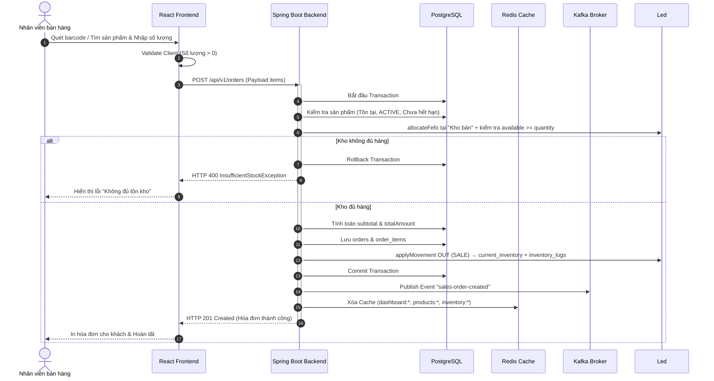
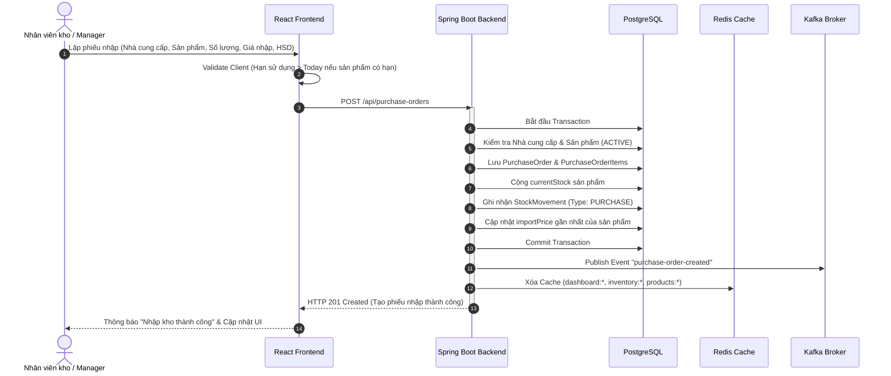

# SmartMart AI - Hệ thống Quản lý Siêu thị Mini & Tối ưu Tồn kho bằng AI
## 02. QUY TẮC NGHIỆP VỤ & PHÂN QUYỀN HỆ THỐNG (BUSINESS RULES & AUTHORIZATION)

---

### 1. Ma trận Phân quyền Hệ thống (Role-Based Access Control - RBAC)
Để bảo vệ an toàn thông tin và ngăn ngừa gian lận dữ liệu, hệ thống triển khai phân quyền nghiêm ngặt theo 4 vai trò của người dùng:

| STT | Chức năng chi tiết | Admin | Manager | Staff | Warehouse Staff |
| :--- | :--- | :---: | :---: | :---: | :---: |
| 1 | **Quản lý người dùng (CRUD Users)** | ✅ | ❌ | ❌ | ❌ |
| 2 | **Quản lý danh mục sản phẩm (Category)** | ✅ | ✅ | ❌ | ✅ |
| 3 | **Quản lý nhà cung cấp (Supplier)** | ✅ | ✅ | ❌ | ✅ |
| 4 | **Quản lý danh mục hàng hóa (Product)** | ✅ | ✅ | Xem cơ bản | ✅ |
| 5 | **Tạo hóa đơn bán hàng trực tiếp (POS)** | ✅ | ✅ | ✅ | ❌ |
| 6 | **Xem hóa đơn bán lẻ** | ✅ | ✅ | Giới hạn (Cá nhân) | ❌ |
| 7 | **Hủy hóa đơn đã bán (Sales Cancel)** | ✅ | ✅ | ❌ | ❌ |
| 8 | **Tạo phiếu nhập kho (Purchase Order)** | ✅ | ✅ | ❌ | ✅ |
| 9 | **Xem phiếu nhập kho** | ✅ | ✅ | ❌ | ✅ |
| 10 | **Xem báo cáo tồn kho & Cảnh báo kho** | ✅ | ✅ | Xem cơ bản | ✅ |
| 11 | **Huấn luyện mô hình AI (Model Train)** | ✅ | ✅ | ❌ | ❌ |
| 12 | **Chạy dự báo nhu cầu (Run Forecast)** | ✅ | ✅ | ❌ | ❌ |
| 13 | **Xem gợi ý đặt hàng (Reorder Suggest)** | ✅ | ✅ | ❌ | ✅ |
| 14 | **Xem báo cáo doanh thu & lợi nhuận** | ✅ | ✅ | ❌ | ❌ |
| 15 | **Duyệt chương trình khuyến mãi đề xuất** | ✅ | ✅ | ❌ | ❌ |
| 16 | **Cài đặt & Cấu hình hệ thống** | ✅ | ❌ | ❌ | ❌ |

---

### 2. Các quy tắc hệ thống tổng quát (General Business Rules)
*   **SYS-01: Tính nhất quán dữ liệu (PostgreSQL Source of Truth):** PostgreSQL là nguồn dữ liệu chính xác và duy nhất của hệ thống. Mọi giao dịch tài chính và số liệu tồn kho phải được ghi nhận thành công vào PostgreSQL trước khi cập nhật các thành phần khác.
*   **SYS-02: Bộ nhớ đệm phi tập trung (Redis Cache):** Redis chỉ dùng để tăng tốc độ truy vấn (đọc dữ liệu) đối với Dashboard, danh sách sản phẩm hoạt động và kết quả dự báo của AI. Tuyệt đối không lưu dữ liệu gốc duy nhất trên Redis. Nếu Redis gặp sự cố, hệ thống tự động truy vấn trực tiếp vào PostgreSQL.
*   **SYS-03: Xử lý bất đồng bộ (Kafka Event Broker):** Kafka được dùng để xử lý các tác vụ thứ cấp sau giao dịch (như tính toán cảnh báo tồn kho, xóa cache Redis, ghi nhật ký hệ thống - audit log) nhằm giảm thiểu thời gian xử lý đồng bộ trên luồng chính.
*   **SYS-04: Ràng buộc tồn kho thực tế:** Tồn khả dụng (`current_inventory.quantity - reserved_quantity`) không được âm sau giao dịch hợp lệ.
*   **SYS-05: Bảo toàn lịch sử dữ liệu (Soft Delete):** Không thực hiện xóa vật lý (Hard Delete) đối với các danh mục, sản phẩm, nhà cung cấp hoặc hóa đơn đã phát sinh giao dịch lịch sử. Sử dụng trạng thái `INACTIVE` hoặc xóa mềm bằng cờ để bảo toàn tính toàn vẹn của báo cáo tài chính.
*   **SYS-06: Đảm bảo giao dịch ACID:** Toàn bộ quá trình tạo hóa đơn bán lẻ hoặc phiếu nhập kho phải được thực hiện trong một Transaction cơ sở dữ liệu duy nhất.
*   **SYS-07: Rollback tự động khi lỗi:** Nếu bất kỳ bước nào trong Transaction bị lỗi (ví dụ: trừ kho lỗi, không lưu được chi tiết hóa đơn), toàn bộ Transaction phải được rollback ngay lập tức để tránh tình trạng sai lệch dữ liệu.
*   **SYS-08: Ghi nhật ký vận hành (Audit Log):** Mọi thao tác làm thay đổi dữ liệu cốt lõi (thay đổi giá bán sản phẩm, duyệt khuyến mãi, khóa tài khoản, tạo phiếu nhập) bắt buộc phải ghi lại Audit Log với thông tin: Actor, Hành động, Thời gian và Dữ liệu trước/sau khi thay đổi.
*   **SYS-09: Xác thực dữ liệu hai lớp (Double Validation):** Dữ liệu đầu vào phải được kiểm tra (Validate) nghiêm ngặt tại cả Frontend (để tối ưu UX) và Backend (để đảm bảo an ninh, tránh bypass API).
*   **SYS-10: Cơ chế cô lập lỗi AI (AI Isolation):** Nếu FastAPI AI Service hoặc Gemini API bị lỗi, toàn bộ các chức năng cốt lõi của siêu thị (Bán hàng POS, Nhập kho, Quản lý tồn kho) phải hoạt động bình thường mà không bị gián đoạn. Riêng gợi ý nhập hàng phải fallback về công thức trung bình bán 30 ngày.

---

### 3. Nghiệp vụ Quản lý Master Data

#### 3.1. Xác thực & Tài khoản (Auth & User Rules)
*   **USR-01:** Email đăng ký tài khoản nhân viên là duy nhất, không được trùng lặp trong hệ thống.
*   **USR-02:** Mật khẩu bắt buộc phải được mã hóa bằng thuật toán BCrypt trước khi lưu vào database. Tuyệt đối không trả thuộc tính `passwordHash` về phía client trong bất kỳ API response nào.
*   **USR-03:** Các tài khoản có trạng thái `INACTIVE` (đã bị khóa) sẽ bị hệ thống từ chối xác thực đăng nhập ngay lập tức.
*   **USR-04:** Token JWT hết hạn sẽ tự động bị đưa vào danh sách đen (Blacklist) trong Redis để ngăn ngừa tấn công Replay Attack.

#### 3.2. Danh mục sản phẩm (Category Rules)
*   **CAT-01:** Tên danh mục không được để trống và không được trùng lặp với danh mục hiện có.
*   **CAT-02:** Không được xóa mềm danh mục nếu danh mục đó đang chứa các sản phẩm có trạng thái kinh doanh `ACTIVE`.
*   **CAT-03:** Danh mục có trạng thái `INACTIVE` không được phép gán cho các sản phẩm mới tạo.

#### 3.3. Nhà cung cấp (Supplier Rules)
*   **SUP-01:** Không được tạo phiếu nhập kho mới từ nhà cung cấp có trạng thái `INACTIVE`.
*   **SUP-02:** Không được xóa mềm nhà cung cấp nếu còn các phiếu nhập kho ở trạng thái chờ duyệt hoặc chưa hoàn tất thanh toán.
*   **SUP-03:** Lịch sử nhập hàng và lịch sử thanh toán công nợ nhà cung cấp phải được lưu trữ tối thiểu 5 năm để phục vụ quyết toán thuế.

#### 3.4. Sản phẩm & Hàng hóa (Product Rules)
*   **PRO-01:** Mã sản phẩm (`productCode`) phải là duy nhất (hệ thống tự sinh theo định dạng `SP000000` hoặc quét trực tiếp từ Barcode của nhà sản xuất).
*   **PRO-02:** Giá bán lẻ niêm yết (`sellingPrice`) bắt buộc phải lớn hơn hoặc bằng giá nhập kho gần nhất (`importPrice`).
*   **PRO-03:** Không PATCH tồn trên `items`. Mọi thay đổi tồn chỉ qua `InventoryLedgerService` (bán, nhập, hủy) → `current_inventory` + `inventory_logs`.
*   **PRO-04:** Sản phẩm cận date hoặc đã hết hạn sử dụng theo lô phải tự động chuyển sang trạng thái hạn chế bán hoặc ngưng bán để đảm bảo sức khỏe người tiêu dùng.
*   **PRO-05:** Mọi item `ACTIVE` phải có `imageUrl` (ảnh thật hoặc placeholder theo danh mục/SKU). API luôn trả `imageUrl` đã resolve; POS và danh sách hàng hiển thị thumbnail, không chỉ tên.

---

### 4. Quy trình Bán hàng tại quầy (Sales POS Workflow)

#### Quy tắc Bán hàng (Sales Rules)
*   **SALE-01:** Hóa đơn bán lẻ hợp lệ phải chứa ít nhất 1 sản phẩm với số lượng mua tối thiểu là 1.
*   **SALE-02:** Hệ thống từ chối bán các sản phẩm có trạng thái `INACTIVE` hoặc sản phẩm đã vượt quá hạn sử dụng (`expiryDate < today`).
*   **SALE-03:** Giá bán của sản phẩm trong hóa đơn được chốt cố định tại thời điểm tạo hóa đơn, không thay đổi theo biến động giá niêm yết sau này.
*   **SALE-04:** Sau khi giao dịch bán hàng thành công, hệ thống phải publish ngay một sự kiện Kafka bất đồng bộ để kiểm tra xem sản phẩm có rơi vào trạng thái cần cảnh báo tồn kho hay không.
*   **SALE-05:** POS phase 1 chỉ được trừ tồn từ location **"Kho bán"**. Hàng ở kho tổng phải được chuyển sang "Kho bán" bằng phiếu chuyển kho trước khi bán.

---

### 4.1. Quy trình Ca bán & Đối soát tiền

*   **SHIFT-01:** Thu ngân phải mở ca trước khi bán để đơn hàng được gắn `shiftId`; mỗi thu ngân chỉ có tối đa 1 ca `OPEN`.
*   **SHIFT-02:** Tiền mặt kỳ vọng cuối ca = `openingCash + tổng thanh toán CASH trong ca`.
*   **SHIFT-03:** Khi đóng ca, nếu `closingCash` lệch `expectedCash` từ 0.01 VND trở lên, nhân viên bắt buộc nhập `varianceReason`.
*   **SHIFT-04:** Ca lệch tiền không được đóng thẳng; trạng thái chuyển sang `PENDING_REVIEW` để Admin/Manager duyệt đối soát.
*   **SHIFT-05:** Sau khi Admin/Manager duyệt, ca chuyển sang `CLOSED`, lưu `reviewedBy`, `reviewedAt`, `reviewNote` và audit log.

### 5. Quy trình Nhập kho (Purchase Order Workflow)

#### Quy tắc Nhập kho (Purchase Rules)
*   **PUR-01:** Phiếu nhập kho bắt buộc phải có thông tin nhà cung cấp và có ít nhất 1 sản phẩm.
*   **PUR-02:** Giá trị nhập kho (`importPrice`) của sản phẩm phải là số dương lớn hơn 0.
*   **PUR-03:** Đối với các sản phẩm có thuộc tính quản lý hạn sử dụng (`hasExpiry = true`), người dùng bắt buộc phải điền hạn sử dụng (`expiryDate`) cho lô hàng nhập. Hạn sử dụng bắt buộc phải lớn hơn ngày hiện tại (`expiryDate > today`).
*   **PUR-04:** Sau khi hoàn tất nhập kho, hệ thống tự động ghi nhận luồng biến động kho tăng tương ứng và tính toán lại giá nhập trung bình của sản phẩm để cập nhật Master Data.
*   **PUR-05:** Nếu phiếu nhập có `paymentDeferred = true`, khi nhận hàng thành công hệ thống tự động sinh công nợ nhà cung cấp với hạn thanh toán mặc định 30 ngày.

#### Quy tắc Công nợ Nhà cung cấp
*   **DEBT-01:** Một phiếu nhập chỉ được sinh tối đa một công nợ.
*   **DEBT-02:** Trạng thái công nợ gồm `UNPAID`, `PARTIAL`, `OVERDUE`, `PAID`.
*   **DEBT-03:** Công nợ chưa thanh toán đủ và có `dueDate < today` tự động chuyển sang `OVERDUE` khi truy vấn.
*   **DEBT-04:** Thanh toán công nợ phải là số dương và không được vượt quá số tiền còn lại.
*   **DEBT-05:** Khi tổng thanh toán đạt đủ số nợ, trạng thái chuyển sang `PAID` và `remainingAmount = 0`.

---

### 6. Quy trình Cảnh báo & Trạng thái Tồn kho (Inventory Alerts)

Hệ thống tự động phân loại mức độ rủi ro tồn kho dựa trên các điều kiện sau:

| Trạng thái tồn kho | Điều kiện kích hoạt cảnh báo | Mức độ nghiêm trọng | Hành động của hệ thống |
| :--- | :--- | :---: | :--- |
| **OUT_OF_STOCK** | `currentStock = 0` | 🔴 CRITICAL | Tạo cảnh báo hết hàng lập tức, ngưng bán sản phẩm trên POS. |
| **LOW_STOCK** | `currentStock <= minStockLevel` | 🟡 WARNING | Gửi cảnh báo tồn kho thấp đến nhân viên kho và đề xuất nhập hàng. |
| **HIGH_RISK (Rủi ro đứt hàng)**| `currentStock < predictedQuantity7Days` | 🟠 HIGH | AI cảnh báo tốc độ bán vượt quá lượng tồn kho hiện tại trong 7 ngày tới. |
| **OVER_STOCK (Tồn kho cao)** | `currentStock > predictedQuantity30Days * 2` | 🔵 INFO | Cảnh báo ứ đọng vốn, gợi ý tạo chương trình khuyến mãi giảm giá. |
| **NEAR_EXPIRY (Cận date)** | `hasExpiry = true` và `0 < (expiryDate - today) <= 30 ngày`| 🟡 WARNING | Tạo cảnh báo hàng cận hạn, gợi ý xả hàng hoặc gộp combo. |
| **EXPIRED (Hết hạn sử dụng)** | `hasExpiry = true` và `expiryDate < today` | 🔴 CRITICAL | Khóa sản phẩm khỏi hệ thống POS, yêu cầu lập phiếu hủy hàng. |

#### Quy trình xử lý cảnh báo (Alert Flow)
1.  Bất kỳ giao dịch làm biến động kho nào hoàn tất sẽ publish một event Kafka.
2.  Consumer lắng nghe sự kiện, truy vấn trạng thái kho hiện tại và đối chiếu với bảng điều kiện cảnh báo.
3.  Nếu phát hiện trạng thái bất thường (ví dụ: tồn kho xuống dưới mức tối thiểu), hệ thống kiểm tra xem đã có cảnh báo tương tự ở trạng thái `ACTIVE` chưa. Nếu chưa có, tạo mới một dòng trong bảng `inventory_alerts`.
4.  Khi hàng hóa được nhập thêm và `currentStock` vượt qua ngưỡng an toàn, hệ thống tự động cập nhật trạng thái cảnh báo cũ từ `ACTIVE` sang `RESOLVED`.

---

### 7. Truy vết biến động kho (Stock Movement)
Mọi sự thay đổi về mặt số lượng của sản phẩm trong kho bắt buộc phải được ghi nhận vào bảng lịch sử biến động kho (`stock_movements`) để phục vụ công tác đối soát dữ liệu và kiểm toán kho:

#### Các loại hình biến động kho (Movement Types)
*   `SALE`: Trừ kho khi bán lẻ tại quầy.
*   `PURCHASE`: Cộng kho khi nhập hàng từ nhà cung cấp.
*   `SALE_CANCEL`: Cộng trả lại kho khi hóa đơn bán hàng bị hủy.
*   `PURCHASE_CANCEL`: Trừ lại kho khi phiếu nhập hàng bị hủy bỏ do lỗi đối tác.
*   `ADJUSTMENT`: Điều chỉnh kho sau khi kiểm kê thực tế (có thể tăng hoặc giảm).
*   `EXPIRED_REMOVE`: Trừ kho khi thanh lý hàng hết hạn sử dụng.

#### Quy tắc Stock Movement (Rules)
*   **STK-01:** Tuyệt đối không được cập nhật (`UPDATE`) hoặc xóa (`DELETE`) các bản ghi trong bảng `stock_movements`. Đây là bảng dữ liệu bất biến (Append-only).
*   **STK-02:** Mỗi bản ghi phải lưu trữ rõ ràng số lượng tồn kho trước khi biến động (`stockBefore`) và số lượng tồn kho ngay sau khi biến động (`stockAfter`) để đảm bảo công thức: `stockAfter = stockBefore + quantity` (hoặc `- quantity`).

---

### 8. Lõi Thuật toán & Công thức Tính toán AI

#### 8.1. Công thức Đề xuất đặt hàng (Reorder Recommendation Formula)
Mỗi khi hệ thống chạy dự báo nhu cầu thành công, lượng hàng tối ưu cần đặt thêm cho từng sản phẩm sẽ được tự động tính toán như sau:

$$\text{recommendedOrderQuantity} = \max(0, \text{predictedDemand} + \text{safetyStock} - \text{currentStock})$$

Trong đó:
*   $\text{predictedDemand}$: Nhu cầu dự báo tiêu dùng của sản phẩm trong chu kỳ tiếp theo (mặc định lấy dự báo bán ra trong 14 ngày tới).
*   $\text{safetyStock}$: Lượng tồn kho an toàn để phòng ngừa rủi ro chậm giao hàng từ nhà cung cấp hoặc biến động nhu cầu tăng đột biến. Tình bằng công thức:
    $$\text{safetyStock} = \text{maxDailySales} \times \text{maxLeadTime} - \text{averageDailySales} \times \text{averageLeadTime}$$
*   $\text{currentStock}$: Lượng tồn kho thực tế hiện tại.

#### 8.2. Đánh giá Rủi ro đứt gãy nguồn cung (Supply Risk Level)
Hệ thống tự động xếp hạng rủi ro đứt hàng của từng sản phẩm để hỗ trợ Manager ưu tiên xử lý:
*   **HIGH RISK (Rủi ro cao):** $\text{currentStock} < \text{predictedQuantity7Days}$. Tồn kho hiện tại không đủ bán cho 7 ngày tới.
*   **MEDIUM RISK (Rủi ro trung bình):** $\text{predictedQuantity7Days} \le \text{currentStock} < \text{predictedQuantity7Days} + \text{safetyStock}$.
*   **LOW RISK (An toàn):** Các trường hợp còn lại.
*   API gợi ý nhập hàng phải trả riêng `predictedDemand7d` và `predictedDemand14d`; số lượng đề xuất mặc định dùng nhu cầu 14 ngày cộng tồn an toàn.

---

### 9. Phân tích Rủi ro Hết hạn & Khuyến mãi (Expiry Risk & Promotions)

#### 9.1. Phân tích Rủi ro hết hạn sử dụng
Đối với sản phẩm có hạn sử dụng, hệ thống tính toán khả năng bán hết trước khi hết hạn nhằm giảm tỷ lệ hàng hủy:

$$\text{expectedSoldBeforeExpiry} = \text{averageDailySales} \times \text{daysUntilExpiry}$$

$$\text{riskQuantity} = \text{currentStock} - \text{expectedSoldBeforeExpiry}$$

Nếu $\text{riskQuantity} > 0$: Hệ thống dự kiến siêu thị sẽ dư thừa một lượng $\text{riskQuantity}$ sản phẩm không thể tiêu thụ hết và sẽ bị hết hạn. Lúc này, hệ thống sẽ tự động kích hoạt đề xuất chương trình khuyến mãi.

#### 9.2. Quy tắc Đề xuất Khuyến mãi (Promotion Recommendation Rules)
*   **PROMO-01 (Quyền phê duyệt):** Hệ thống chỉ đưa ra gợi ý và mức chiết khấu đề xuất dựa trên dữ liệu. Quyết định áp dụng và thay đổi giá bán thực tế hoàn toàn thuộc về Manager.
*   **PROMO-02 (Quy tắc cận date):** Sản phẩm cận date ($\text{daysUntilExpiry} \le 15$ ngày) và có $\text{riskQuantity} > 0$ sẽ được gợi ý giảm giá sâu ($20\% - 50\%$) hoặc tạo combo mua 1 tặng 1 để xả hàng nhanh.
*   **PROMO-03 (Quy tắc tồn kho cao):** Sản phẩm có cảnh báo tồn kho cao nhưng hạn sử dụng còn dài sẽ được gợi ý giảm giá nhẹ ($5\% - 10\%$) để kích cầu tiêu dùng.
*   **PROMO-04 (Chặn khuyến mãi):** Hệ thống cấm đề xuất khuyến mãi đối với các sản phẩm đang có cảnh báo tồn kho thấp (`LOW_STOCK`) hoặc rủi ro đứt hàng (`HIGH_RISK`) để tránh làm trầm trọng thêm tình trạng thiếu hụt hàng hóa.
