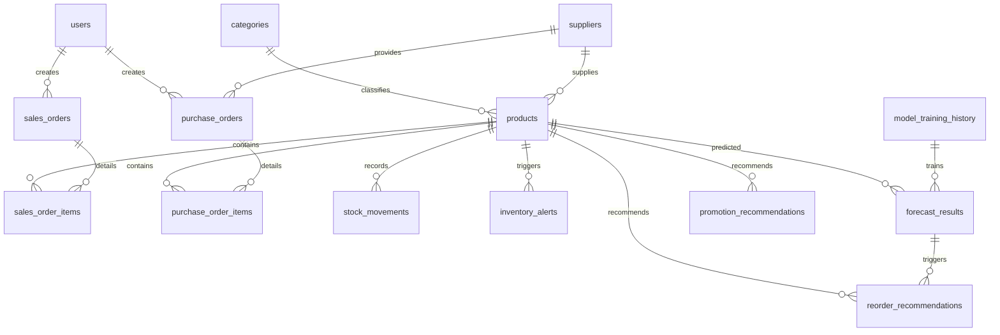

# SmartMart AI - Hệ thống Quản lý Siêu thị Mini & Tối ưu Tồn kho bằng AI
## 03. THIẾT KẾ CƠ SỞ DỮ LIỆU (DATABASE DESIGN)

---

### 1. Phân nhóm Hệ thống Bảng Cơ sở Dữ liệu
Hệ thống sử dụng cơ sở dữ liệu **PostgreSQL** để đảm bảo tính toàn vẹn giao dịch và hiệu năng truy vấn cao. 16 bảng trong hệ thống được phân chia khoa học thành 8 phân hệ nghiệp vụ:



| Phân hệ (Module) | Tên bảng (Table Name) | Vai trò nghiệp vụ |
| :--- | :--- | :--- |
| **1. User/Auth** | `users` | Lưu trữ thông tin tài khoản nhân viên, mật khẩu đã mã hóa và quyền hạn (Role). |
| **2. Master Data** | `categories`<br>`suppliers`<br>`products` | Quản lý danh mục hàng hóa.<br>Quản lý thông tin nhà cung cấp.<br>Thông tin chi tiết sản phẩm, giá bán, giá nhập, tồn kho. |
| **3. Sales (POS)** | `sales_orders`<br>`sales_order_items` | Lưu trữ thông tin tổng quát hóa đơn bán lẻ tại quầy.<br>Chi tiết từng mặt hàng, số lượng và đơn giá trong hóa đơn. |
| **4. Purchase** | `purchase_orders`<br>`purchase_order_items` | Phiếu nhập kho từ nhà cung cấp.<br>Chi tiết các mặt hàng, số lượng, giá nhập và hạn sử dụng của lô nhập. |
| **5. Inventory** | `stock_movements`<br>`inventory_alerts` | Lịch sử bất biến ghi nhận mọi biến động kho của từng sản phẩm.<br>Nhật ký ghi nhận các cảnh báo kho (hết hàng, cận date, tồn cao). |
| **6. AI Forecast** | `model_training_history`<br>`forecast_results` | Nhật ký các lần huấn luyện mô hình AI kèm các chỉ số MAE/RMSE/MAPE.<br>Chi tiết kết quả dự báo số lượng tiêu thụ trong 7/14/30 ngày tới. |
| **7. Recommendations** | `reorder_recommendations`<br>`promotion_recommendations` | Gợi ý đặt hàng thông minh dựa trên AI Forecast.<br>Gợi ý giảm giá xả hàng cho sản phẩm cận date hoặc tồn kho cao. |
| **8. Governance** | `audit_logs`<br>`settings` | Ghi vết mọi hoạt động nhạy cảm của người dùng trên hệ thống.<br>Lưu trữ các cấu hình tham số hệ thống (hạn dùng, ngưỡng báo động). |

---

### 2. Thiết kế chi tiết các bảng Dữ liệu (Entity Definitions)

#### 2.1. Phân hệ User/Auth
*   **users:**
    *   `id`: UUID (Primary Key) - Định danh duy nhất.
    *   `full_name`: VARCHAR(100) - Họ tên đầy đủ nhân viên.
    *   `email`: VARCHAR(100) (Unique, Index) - Email đăng nhập.
    *   `password_hash`: VARCHAR(255) - Mật khẩu đã mã hóa BCrypt.
    *   `role`: VARCHAR(20) - Vai trò: `ADMIN`, `MANAGER`, `STAFF`, `WAREHOUSE`.
    *   `status`: VARCHAR(20) - Trạng thái: `ACTIVE`, `INACTIVE`.
    *   `created_at`, `updated_at`: TIMESTAMP - Thời gian tạo và cập nhật.

#### 2.2. Phân hệ Master Data
*   **categories:**
    *   `id`: BIGSERIAL (Primary Key) - Định danh tự tăng.
    *   `name`: VARCHAR(100) (Unique) - Tên danh mục sản phẩm.
    *   `description`: TEXT - Mô tả danh mục.
    *   `status`: VARCHAR(20) - Trạng thái: `ACTIVE`, `INACTIVE`.
    *   `created_at`, `updated_at`: TIMESTAMP.
*   **suppliers:**
    *   `id`: BIGSERIAL (Primary Key) - Định danh tự tăng.
    *   `name`: VARCHAR(150) - Tên nhà cung cấp.
    *   `code`: VARCHAR(50) (Unique) - Mã nhà cung cấp (VD: NCC001).
    *   `phone`: VARCHAR(20) - Số điện thoại liên hệ.
    *   `email`: VARCHAR(100) - Email nhà cung cấp.
    *   `address`: TEXT - Địa chỉ.
    *   `status`: VARCHAR(20) - Trạng thái: `ACTIVE`, `INACTIVE`.
    *   `created_at`, `updated_at`: TIMESTAMP.
*   **products:**
    *   `id`: BIGSERIAL (Primary Key) - Định danh tự tăng.
    *   `product_code`: VARCHAR(50) (Unique, Index) - Mã vạch/Barcode sản phẩm.
    *   `name`: VARCHAR(150) (Index) - Tên sản phẩm.
    *   `category_id`: BIGINT (Foreign Key -> `categories.id`) - Thuộc danh mục.
    *   `supplier_id`: BIGINT (Foreign Key -> `suppliers.id`) - Nhà cung cấp chính.
    *   `unit`: VARCHAR(20) - Đơn vị tính (Chai, Lon, Gói, Hộp...).
    *   `import_price`: DECIMAL(12, 2) - Giá nhập kho gần nhất.
    *   `selling_price`: DECIMAL(12, 2) - Giá bán lẻ niêm yết.
    *   `current_stock`: INT - Số lượng tồn kho thực tế hiện tại.
    *   `min_stock_level`: INT - Ngưỡng tồn kho tối thiểu.
    *   `safety_stock`: INT - Lượng tồn kho an toàn tính toán.
    *   `has_expiry`: BOOLEAN - Có quản lý hạn sử dụng hay không.
    *   `expiry_date`: DATE - Hạn sử dụng của lô hiện tại (nếu có).
    *   `status`: VARCHAR(20) - Trạng thái kinh doanh: `ACTIVE`, `INACTIVE`.
    *   `created_at`, `updated_at`: TIMESTAMP.

#### 2.3. Phân hệ Sales (POS)
*   **sales_orders:**
    *   `id`: BIGSERIAL (Primary Key) - Định danh tự tăng.
    *   `order_code`: VARCHAR(50) (Unique, Index) - Mã hóa đơn (VD: HD000001).
    *   `staff_id`: UUID (Foreign Key -> `users.id`) - Nhân viên tạo hóa đơn.
    *   `sale_date`: TIMESTAMP (Index) - Ngày giờ mua hàng.
    *   `total_amount`: DECIMAL(12, 2) - Tổng tiền hóa đơn.
    *   `payment_method`: VARCHAR(20) - Phương thức thanh toán: `CASH`, `BANK_TRANSFER`, `E_WALLET`.
    *   `status`: VARCHAR(20) - Trạng thái: `COMPLETED`, `CANCELLED`.
    *   `created_at`, `updated_at`: TIMESTAMP.
*   **sales_order_items:**
    *   `id`: BIGSERIAL (Primary Key) - Định danh tự tăng.
    *   `sales_order_id`: BIGINT (Foreign Key -> `sales_orders.id` ON DELETE CASCADE) - Thuộc hóa đơn.
    *   `product_id`: BIGINT (Foreign Key -> `products.id`) - Sản phẩm bán ra.
    *   `quantity`: INT - Số lượng mua.
    *   `price`: DECIMAL(12, 2) - Giá bán thực tế tại thời điểm mua.
    *   `subtotal`: DECIMAL(12, 2) - Thành tiền (`quantity * price`).

#### 2.4. Phân hệ Purchase (Nhập kho)
*   **purchase_orders:**
    *   `id`: BIGSERIAL (Primary Key) - Định danh tự tăng.
    *   `purchase_code`: VARCHAR(50) (Unique, Index) - Mã phiếu nhập (VD: PN000001).
    *   `supplier_id`: BIGINT (Foreign Key -> `suppliers.id`) - Nhà cung cấp.
    *   `created_by`: UUID (Foreign Key -> `users.id`) - Người lập phiếu nhập.
    *   `purchase_date`: TIMESTAMP (Index) - Ngày giờ nhập kho.
    *   `total_cost`: DECIMAL(12, 2) - Tổng giá trị nhập kho.
    *   `status`: VARCHAR(20) - Trạng thái: `COMPLETED`, `CANCELLED`.
    *   `created_at`, `updated_at`: TIMESTAMP.
*   **purchase_order_items:**
    *   `id`: BIGSERIAL (Primary Key) - Định danh tự tăng.
    *   `purchase_order_id`: BIGINT (Foreign Key -> `purchase_orders.id` ON DELETE CASCADE) - Thuộc phiếu nhập.
    *   `product_id`: BIGINT (Foreign Key -> `products.id`) - Sản phẩm nhập kho.
    *   `quantity`: INT - Số lượng nhập.
    *   `import_price`: DECIMAL(12, 2) - Giá nhập kho của lô này.
    *   `expiry_date`: DATE - Hạn sử dụng của lô này (nếu có).
    *   `subtotal`: DECIMAL(12, 2) - Thành tiền (`quantity * import_price`).

#### 2.5. Phân hệ Inventory (Tồn kho)
*   **stock_movements:**
    *   `id`: BIGSERIAL (Primary Key) - Định danh tự tăng.
    *   `product_id`: BIGINT (Foreign Key -> `products.id`) - Sản phẩm bị thay đổi số lượng.
    *   `movement_type`: VARCHAR(20) - Loại biến động: `SALE`, `PURCHASE`, `SALE_CANCEL`, `PURCHASE_CANCEL`, `ADJUSTMENT`, `EXPIRED_REMOVE`.
    *   `quantity`: INT - Số lượng thay đổi (luôn là số dương).
    *   `stock_before`: INT - Số lượng tồn kho trước khi thay đổi.
    *   `stock_after`: INT - Số lượng tồn kho sau khi thay đổi.
    *   `reference_type`: VARCHAR(50) - Giao dịch tham chiếu: `SALES_ORDER`, `PURCHASE_ORDER`, `INVENTORY_CHECK`.
    *   `reference_id`: BIGINT - ID của giao dịch tham chiếu tương ứng.
    *   `note`: TEXT - Lý do thay đổi chi tiết.
    *   `created_at`: TIMESTAMP (Index) - Thời điểm ghi nhận.
*   **inventory_alerts:**
    *   `id`: BIGSERIAL (Primary Key).
    *   `product_id`: BIGINT (Foreign Key -> `products.id`).
    *   `alert_type`: VARCHAR(30) - `OUT_OF_STOCK`, `LOW_STOCK`, `HIGH_RISK`, `OVER_STOCK`, `NEAR_EXPIRY`, `EXPIRED`.
    *   `severity`: VARCHAR(20) - `INFO`, `WARNING`, `CRITICAL`.
    *   `message`: TEXT - Nội dung cảnh báo chi tiết.
    *   `status`: VARCHAR(20) - Trạng thái cảnh báo: `ACTIVE`, `RESOLVED`.
    *   `created_at`, `resolved_at`: TIMESTAMP.

#### 2.6. Phân hệ AI Forecast & Recommendations
*   **model_training_history:**
    *   `id`: BIGSERIAL (Primary Key).
    *   `trained_at`: TIMESTAMP.
    *   `model_type`: VARCHAR(50) - `MOVING_AVERAGE`, `RANDOM_FOREST`, `XGBOOST`.
    *   `mae`, `rmse`, `mape`: DECIMAL(8, 4) - Các chỉ số sai số của mô hình.
    *   `dataset_size`: INT - Số lượng dòng dữ liệu dùng để train.
    *   `status`: VARCHAR(20) - `SUCCESS`, `FAILED`.
    *   `error_message`: TEXT - Lỗi nếu huấn luyện thất bại.
*   **forecast_results:**
    *   `id`: BIGSERIAL (Primary Key).
    *   `product_id`: BIGINT (Foreign Key -> `products.id`).
    *   `model_training_id`: BIGINT (Foreign Key -> `model_training_history.id`).
    *   `forecast_date`: DATE (Index) - Ngày thực hiện dự báo.
    *   `predicted_quantity_7d`: INT - Dự báo số lượng bán ra trong 7 ngày tới.
    *   `predicted_quantity_14d`: INT - Dự báo số lượng bán ra trong 14 ngày tới.
    *   `predicted_quantity_30d`: INT - Dự báo số lượng bán ra trong 30 ngày tới.
    *   `mae`, `rmse`, `mape`: DECIMAL(8, 4) - Chỉ số sai số riêng của sản phẩm này.
    *   `created_at`: TIMESTAMP.
*   **reorder_recommendations:**
    *   `id`: BIGSERIAL (Primary Key).
    *   `forecast_result_id`: BIGINT (Foreign Key -> `forecast_results.id`).
    *   `product_id`: BIGINT (Foreign Key -> `products.id`).
    *   `current_stock`: INT - Tồn kho thực tế lúc gợi ý.
    *   `predicted_demand`: INT - Nhu cầu dự báo bán lẻ.
    *   `safety_stock`: INT - Tồn kho an toàn tính toán.
    *   `recommended_quantity`: INT - Số lượng gợi ý nhập hàng tối ưu.
    *   `risk_level`: VARCHAR(20) - `HIGH`, `MEDIUM`, `LOW`.
    *   `reason`: TEXT - Lý do đưa ra gợi ý bằng tiếng Việt.
    *   `status`: VARCHAR(20) - `PENDING` (Chờ xử lý), `APPROVED` (Đã tạo phiếu nhập), `IGNORED` (Bỏ qua).
    *   `created_at`, `approved_at`: TIMESTAMP.
*   **promotion_recommendations:**
    *   `id`: BIGSERIAL (Primary Key).
    *   `product_id`: BIGINT (Foreign Key -> `products.id`).
    *   `current_stock`: INT - Tồn thực tế.
    *   `risk_quantity`: INT - Lượng hàng dự kiến bị hết hạn không bán kịp.
    *   `suggested_discount_rate`: DECIMAL(5, 2) - Tỷ lệ phần trăm giảm giá đề xuất (VD: 15.00).
    *   `reason`: TEXT - Lý do khuyến mãi (Cận date/Tồn cao).
    *   `status`: VARCHAR(20) - `PENDING`, `APPROVED`, `REJECTED`.
    *   `created_at`, `approved_at`: TIMESTAMP.

#### 2.7. Phân hệ Governance (Quản trị & Cấu hình)
*   **audit_logs:**
    *   `id`: BIGSERIAL (Primary Key).
    *   `user_id`: UUID (Foreign Key -> `users.id` NULLABLE cho trường hợp hệ thống tự động).
    *   `action`: VARCHAR(100) (Index) - Hành động (VD: CREATE_USER, APPROVE_PROMOTION).
    *   `affected_table`: VARCHAR(50) - Bảng bị ảnh hưởng.
    *   `affected_id`: VARCHAR(100) - ID của bản ghi bị ảnh hưởng.
    *   `old_value`: TEXT - Giá trị cũ (JSON format).
    *   `new_value`: TEXT - Giá trị mới (JSON format).
    *   `ip_address`: VARCHAR(45) - IP máy khách thực hiện hành động.
    *   `created_at`: TIMESTAMP.
*   **settings:**
    *   `id`: BIGSERIAL (Primary Key).
    *   `key`: VARCHAR(100) (Unique) - Khóa cấu hình (VD: `safety_stock_lead_time_days`).
    *   `value`: TEXT - Giá trị cấu hình.
    *   `description`: TEXT - Giải thích ý nghĩa cấu hình.
    *   `updated_by`: UUID (Foreign Key -> `users.id`).
    *   `updated_at`: TIMESTAMP.

---

### 3. Kịch bản SQL DDL Tạo Bảng Hoàn Chỉnh (PostgreSQL DDL)
Dưới đây là mã SQL chuẩn hóa để tạo toàn bộ cơ sở dữ liệu cho dự án SmartMart AI, tích hợp đầy đủ cấu trúc khóa ngoại, giá trị mặc định, kiểm tra ràng buộc (constraints) và tối ưu hóa hiệu năng bằng Index:

```sql
-- KỊCH BẢN DDL KHỞI TẠO CƠ SỞ DỮ LIỆU SMARTMART AI (POSTGRESQL)
CREATE EXTENSION IF NOT EXISTS "uuid-ossp";

-- ==========================================
-- 1. PHÂN HỆ USER / AUTH
-- ==========================================
CREATE TABLE users (
    id UUID PRIMARY KEY DEFAULT uuid_generate_v4(),
    full_name VARCHAR(100) NOT NULL,
    email VARCHAR(100) UNIQUE NOT NULL,
    password_hash VARCHAR(255) NOT NULL,
    role VARCHAR(20) NOT NULL CHECK (role IN ('ADMIN', 'MANAGER', 'STAFF', 'WAREHOUSE')),
    status VARCHAR(20) NOT NULL DEFAULT 'ACTIVE' CHECK (status IN ('ACTIVE', 'INACTIVE')),
    created_at TIMESTAMP NOT NULL DEFAULT CURRENT_TIMESTAMP,
    updated_at TIMESTAMP NOT NULL DEFAULT CURRENT_TIMESTAMP
);

CREATE INDEX idx_users_email ON users(email);

-- ==========================================
-- 2. PHÂN HỆ MASTER DATA
-- ==========================================
CREATE TABLE categories (
    id BIGSERIAL PRIMARY KEY,
    name VARCHAR(100) UNIQUE NOT NULL,
    description TEXT,
    status VARCHAR(20) NOT NULL DEFAULT 'ACTIVE' CHECK (status IN ('ACTIVE', 'INACTIVE')),
    created_at TIMESTAMP NOT NULL DEFAULT CURRENT_TIMESTAMP,
    updated_at TIMESTAMP NOT NULL DEFAULT CURRENT_TIMESTAMP
);

CREATE TABLE suppliers (
    id BIGSERIAL PRIMARY KEY,
    name VARCHAR(150) NOT NULL,
    code VARCHAR(50) UNIQUE NOT NULL,
    phone VARCHAR(20),
    email VARCHAR(100),
    address TEXT,
    status VARCHAR(20) NOT NULL DEFAULT 'ACTIVE' CHECK (status IN ('ACTIVE', 'INACTIVE')),
    created_at TIMESTAMP NOT NULL DEFAULT CURRENT_TIMESTAMP,
    updated_at TIMESTAMP NOT NULL DEFAULT CURRENT_TIMESTAMP
);

CREATE TABLE products (
    id BIGSERIAL PRIMARY KEY,
    product_code VARCHAR(50) UNIQUE NOT NULL,
    name VARCHAR(150) NOT NULL,
    category_id BIGINT NOT NULL REFERENCES categories(id) ON DELETE RESTRICT,
    supplier_id BIGINT NOT NULL REFERENCES suppliers(id) ON DELETE RESTRICT,
    unit VARCHAR(20) NOT NULL,
    import_price DECIMAL(12, 2) NOT NULL DEFAULT 0.00 CHECK (import_price >= 0),
    selling_price DECIMAL(12, 2) NOT NULL DEFAULT 0.00 CHECK (selling_price >= import_price),
    current_stock INT NOT NULL DEFAULT 0 CHECK (current_stock >= 0),
    min_stock_level INT NOT NULL DEFAULT 10 CHECK (min_stock_level >= 0),
    safety_stock INT NOT NULL DEFAULT 5 CHECK (safety_stock >= 0),
    has_expiry BOOLEAN NOT NULL DEFAULT FALSE,
    expiry_date DATE,
    status VARCHAR(20) NOT NULL DEFAULT 'ACTIVE' CHECK (status IN ('ACTIVE', 'INACTIVE')),
    created_at TIMESTAMP NOT NULL DEFAULT CURRENT_TIMESTAMP,
    updated_at TIMESTAMP NOT NULL DEFAULT CURRENT_TIMESTAMP
);

CREATE INDEX idx_products_code ON products(product_code);
CREATE INDEX idx_products_name ON products(name);
CREATE INDEX idx_products_category ON products(category_id);

-- ==========================================
-- 3. PHÂN HỆ SALES (POS)
-- ==========================================
CREATE TABLE sales_orders (
    id BIGSERIAL PRIMARY KEY,
    order_code VARCHAR(50) UNIQUE NOT NULL,
    staff_id UUID NOT NULL REFERENCES users(id) ON DELETE RESTRICT,
    sale_date TIMESTAMP NOT NULL DEFAULT CURRENT_TIMESTAMP,
    total_amount DECIMAL(12, 2) NOT NULL DEFAULT 0.00 CHECK (total_amount >= 0),
    payment_method VARCHAR(20) NOT NULL CHECK (payment_method IN ('CASH', 'BANK_TRANSFER', 'E_WALLET')),
    status VARCHAR(20) NOT NULL DEFAULT 'COMPLETED' CHECK (status IN ('COMPLETED', 'CANCELLED')),
    created_at TIMESTAMP NOT NULL DEFAULT CURRENT_TIMESTAMP,
    updated_at TIMESTAMP NOT NULL DEFAULT CURRENT_TIMESTAMP
);

CREATE INDEX idx_sales_date ON sales_orders(sale_date);
CREATE INDEX idx_sales_code ON sales_orders(order_code);

CREATE TABLE sales_order_items (
    id BIGSERIAL PRIMARY KEY,
    sales_order_id BIGINT NOT NULL REFERENCES sales_orders(id) ON DELETE CASCADE,
    product_id BIGINT NOT NULL REFERENCES products(id) ON DELETE RESTRICT,
    quantity INT NOT NULL CHECK (quantity > 0),
    price DECIMAL(12, 2) NOT NULL CHECK (price >= 0),
    subtotal DECIMAL(12, 2) NOT NULL CHECK (subtotal >= 0)
);

-- ==========================================
-- 4. PHÂN HỆ PURCHASE (NHẬP KHO)
-- ==========================================
CREATE TABLE purchase_orders (
    id BIGSERIAL PRIMARY KEY,
    purchase_code VARCHAR(50) UNIQUE NOT NULL,
    supplier_id BIGINT NOT NULL REFERENCES suppliers(id) ON DELETE RESTRICT,
    created_by UUID NOT NULL REFERENCES users(id) ON DELETE RESTRICT,
    purchase_date TIMESTAMP NOT NULL DEFAULT CURRENT_TIMESTAMP,
    total_cost DECIMAL(12, 2) NOT NULL DEFAULT 0.00 CHECK (total_cost >= 0),
    status VARCHAR(20) NOT NULL DEFAULT 'COMPLETED' CHECK (status IN ('COMPLETED', 'CANCELLED')),
    created_at TIMESTAMP NOT NULL DEFAULT CURRENT_TIMESTAMP,
    updated_at TIMESTAMP NOT NULL DEFAULT CURRENT_TIMESTAMP
);

CREATE INDEX idx_purchase_date ON purchase_orders(purchase_date);

CREATE TABLE purchase_order_items (
    id BIGSERIAL PRIMARY KEY,
    purchase_order_id BIGINT NOT NULL REFERENCES purchase_orders(id) ON DELETE CASCADE,
    product_id BIGINT NOT NULL REFERENCES products(id) ON DELETE RESTRICT,
    quantity INT NOT NULL CHECK (quantity > 0),
    import_price DECIMAL(12, 2) NOT NULL CHECK (import_price >= 0),
    expiry_date DATE,
    subtotal DECIMAL(12, 2) NOT NULL CHECK (subtotal >= 0)
);

-- ==========================================
-- 5. PHÂN HỆ INVENTORY (TỒN KHO)
-- ==========================================
CREATE TABLE stock_movements (
    id BIGSERIAL PRIMARY KEY,
    product_id BIGINT NOT NULL REFERENCES products(id) ON DELETE RESTRICT,
    movement_type VARCHAR(20) NOT NULL CHECK (movement_type IN ('SALE', 'PURCHASE', 'SALE_CANCEL', 'PURCHASE_CANCEL', 'ADJUSTMENT', 'EXPIRED_REMOVE')),
    quantity INT NOT NULL CHECK (quantity > 0),
    stock_before INT NOT NULL CHECK (stock_before >= 0),
    stock_after INT NOT NULL CHECK (stock_after >= 0),
    reference_type VARCHAR(50) NOT NULL CHECK (reference_type IN ('SALES_ORDER', 'PURCHASE_ORDER', 'INVENTORY_CHECK')),
    reference_id BIGINT NOT NULL,
    note TEXT,
    created_at TIMESTAMP NOT NULL DEFAULT CURRENT_TIMESTAMP
);

CREATE INDEX idx_movements_product ON stock_movements(product_id);
CREATE INDEX idx_movements_created ON stock_movements(created_at);

CREATE TABLE inventory_alerts (
    id BIGSERIAL PRIMARY KEY,
    product_id BIGINT NOT NULL REFERENCES products(id) ON DELETE RESTRICT,
    alert_type VARCHAR(30) NOT NULL CHECK (alert_type IN ('OUT_OF_STOCK', 'LOW_STOCK', 'HIGH_RISK', 'OVER_STOCK', 'NEAR_EXPIRY', 'EXPIRED')),
    severity VARCHAR(20) NOT NULL CHECK (severity IN ('INFO', 'WARNING', 'CRITICAL')),
    message TEXT NOT NULL,
    status VARCHAR(20) NOT NULL DEFAULT 'ACTIVE' CHECK (status IN ('ACTIVE', 'RESOLVED')),
    created_at TIMESTAMP NOT NULL DEFAULT CURRENT_TIMESTAMP,
    resolved_at TIMESTAMP
);

CREATE INDEX idx_alerts_status ON inventory_alerts(status);

-- ==========================================
-- 6. PHÂN HỆ AI FORECAST
-- ==========================================
CREATE TABLE model_training_history (
    id BIGSERIAL PRIMARY KEY,
    trained_at TIMESTAMP NOT NULL DEFAULT CURRENT_TIMESTAMP,
    model_type VARCHAR(50) NOT NULL CHECK (model_type IN ('MOVING_AVERAGE', 'RANDOM_FOREST', 'XGBOOST')),
    mae DECIMAL(8, 4),
    rmse DECIMAL(8, 4),
    mape DECIMAL(8, 4),
    dataset_size INT NOT NULL CHECK (dataset_size >= 0),
    status VARCHAR(20) NOT NULL CHECK (status IN ('SUCCESS', 'FAILED')),
    error_message TEXT
);

CREATE TABLE forecast_results (
    id BIGSERIAL PRIMARY KEY,
    product_id BIGINT NOT NULL REFERENCES products(id) ON DELETE RESTRICT,
    model_training_id BIGINT NOT NULL REFERENCES model_training_history(id) ON DELETE RESTRICT,
    forecast_date DATE NOT NULL DEFAULT CURRENT_DATE,
    predicted_quantity_7d INT NOT NULL DEFAULT 0 CHECK (predicted_quantity_7d >= 0),
    predicted_quantity_14d INT NOT NULL DEFAULT 0 CHECK (predicted_quantity_14d >= 0),
    predicted_quantity_30d INT NOT NULL DEFAULT 0 CHECK (predicted_quantity_30d >= 0),
    mae DECIMAL(8, 4),
    rmse DECIMAL(8, 4),
    mape DECIMAL(8, 4),
    created_at TIMESTAMP NOT NULL DEFAULT CURRENT_TIMESTAMP
);

CREATE INDEX idx_forecast_date ON forecast_results(forecast_date);
CREATE INDEX idx_forecast_product ON forecast_results(product_id);

-- ==========================================
-- 7. PHÂN HỆ RECOMMENDATIONS
-- ==========================================
CREATE TABLE reorder_recommendations (
    id BIGSERIAL PRIMARY KEY,
    forecast_result_id BIGINT NOT NULL REFERENCES forecast_results(id) ON DELETE RESTRICT,
    product_id BIGINT NOT NULL REFERENCES products(id) ON DELETE RESTRICT,
    current_stock INT NOT NULL CHECK (current_stock >= 0),
    predicted_demand INT NOT NULL CHECK (predicted_demand >= 0),
    safety_stock INT NOT NULL CHECK (safety_stock >= 0),
    recommended_quantity INT NOT NULL CHECK (recommended_quantity >= 0),
    risk_level VARCHAR(20) NOT NULL CHECK (risk_level IN ('HIGH', 'MEDIUM', 'LOW')),
    reason TEXT,
    status VARCHAR(20) NOT NULL DEFAULT 'PENDING' CHECK (status IN ('PENDING', 'APPROVED', 'IGNORED')),
    created_at TIMESTAMP NOT NULL DEFAULT CURRENT_TIMESTAMP,
    approved_at TIMESTAMP
);

CREATE TABLE promotion_recommendations (
    id BIGSERIAL PRIMARY KEY,
    product_id BIGINT NOT NULL REFERENCES products(id) ON DELETE RESTRICT,
    current_stock INT NOT NULL CHECK (current_stock >= 0),
    risk_quantity INT NOT NULL CHECK (risk_quantity >= 0),
    suggested_discount_rate DECIMAL(5, 2) NOT NULL CHECK (suggested_discount_rate >= 0.00 AND suggested_discount_rate <= 100.00),
    reason TEXT,
    status VARCHAR(20) NOT NULL DEFAULT 'PENDING' CHECK (status IN ('PENDING', 'APPROVED', 'REJECTED')),
    created_at TIMESTAMP NOT NULL DEFAULT CURRENT_TIMESTAMP,
    approved_at TIMESTAMP
);

-- ==========================================
-- 8. PHÂN HỆ GOVERNANCE
-- ==========================================
CREATE TABLE audit_logs (
    id BIGSERIAL PRIMARY KEY,
    user_id UUID REFERENCES users(id) ON DELETE SET NULL,
    action VARCHAR(100) NOT NULL,
    affected_table VARCHAR(50) NOT NULL,
    affected_id VARCHAR(100) NOT NULL,
    old_value TEXT,
    new_value TEXT,
    ip_address VARCHAR(45),
    created_at TIMESTAMP NOT NULL DEFAULT CURRENT_TIMESTAMP
);

CREATE INDEX idx_audit_action ON audit_logs(action);

CREATE TABLE settings (
    id BIGSERIAL PRIMARY KEY,
    key VARCHAR(100) UNIQUE NOT NULL,
    value TEXT NOT NULL,
    description TEXT,
    updated_by UUID REFERENCES users(id) ON DELETE SET NULL,
    updated_at TIMESTAMP NOT NULL DEFAULT CURRENT_TIMESTAMP
);
```
