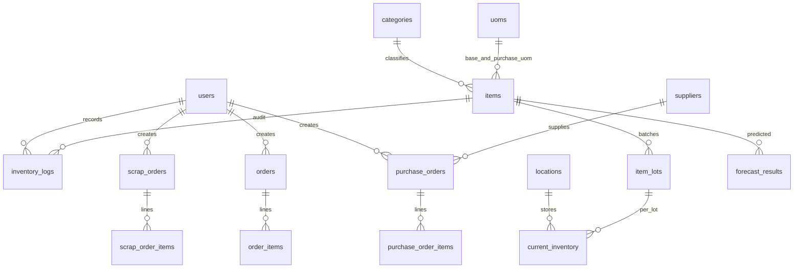

# SmartMart AI — WMS Database Design (docs/03)

PostgreSQL schema cho **Warehouse Management System**: tồn theo **item + location + lot**, mọi biến động qua **inventory_logs** (before/after). Master data dùng `BIGSERIAL`; `users` giữ `UUID` (JWT).

## ERD cốt lõi

## Nhóm bảng

| Nhóm | Bảng | Vai trò |
|------|------|---------|
| Auth | `users` | Đăng nhập, RBAC, audit `user_id` |
| Master | `categories`, `uoms`, `items`, `suppliers`, `locations` | SKU, UOM quy đổi, NCC, cây kho |
| Tồn | `item_lots`, `current_inventory` | Tồn 3 chiều; `reserved_quantity` |
| Sổ kho | `inventory_logs` | Bất biến: before/change/after, reference |
| Mua | `purchase_orders`, `purchase_order_items` | ordered vs received, lot, location |
| Bán | `orders`, `order_items` | POS — trừ tồn qua ledger |
| Hủy | `scrap_orders`, `scrap_order_items` | Xuất hủy cận date / hỏng |
| AI (mở rộng) | `forecast_results`, `promotion_recommendations`, … | FK → `items.id` |

Migration Flyway: `backend/src/main/resources/db/migration/V1__wms_baseline.sql`

## Chi tiết bảng chính

### users (UUID PK)

| Cột | Kiểu | Ghi chú |
|-----|------|---------|
| id | UUID | PK |
| username | VARCHAR(100) UNIQUE | |
| password_hash | VARCHAR(255) | BCrypt |
| email | VARCHAR(100) UNIQUE | |
| role | VARCHAR(30) | ROLE_ADMIN, ROLE_MANAGER, ROLE_STAFF, ROLE_WAREHOUSE |

### items (BIGSERIAL PK)

| Cột | Kiểu | Ghi chú |
|-----|------|---------|
| item_code | VARCHAR(50) UNIQUE | SKU |
| category_id | BIGINT FK | |
| base_uom_id, purchase_uom_id | BIGINT FK | Quy đổi qua `uoms.conversion_ratio` |
| cost_price, selling_price | DECIMAL | |
| minimum_stock | INT | Ngưỡng cảnh báo |
| image_url | VARCHAR(512) | URL ảnh đại diện (`/media/items/{sku}.svg` hoặc upload) |
| **Không** lưu tồn trên row này | | |

### categories — bổ sung

| image_url | VARCHAR(512) | Icon danh mục (`/media/categories/*.svg`) |

### current_inventory

UNIQUE `(item_id, location_id, lot_id)`.

| Cột | Ghi chú |
|-----|---------|
| quantity | Tồn thực |
| reserved_quantity | Giữ hàng |
| available | `quantity - reserved_quantity` |

### inventory_logs (append-only)

`quantity_before`, `quantity_change`, `quantity_after`, `action_type`, `reference_type/id`, `user_id`.

## Quy tắc kiến trúc

1. Mọi thay đổi tồn qua `InventoryLedgerService` — không PATCH tồn trên `items`.
2. Bán: `available >= qty`; lot hết hạn → `PRODUCT_EXPIRED`.
3. Seed location **"Kho bán"** cho POS Phase 1.
4. Local & prod: PostgreSQL + Flyway + `ddl-auto: validate`. Integration tests: profile `test` (H2 `create-drop`).
