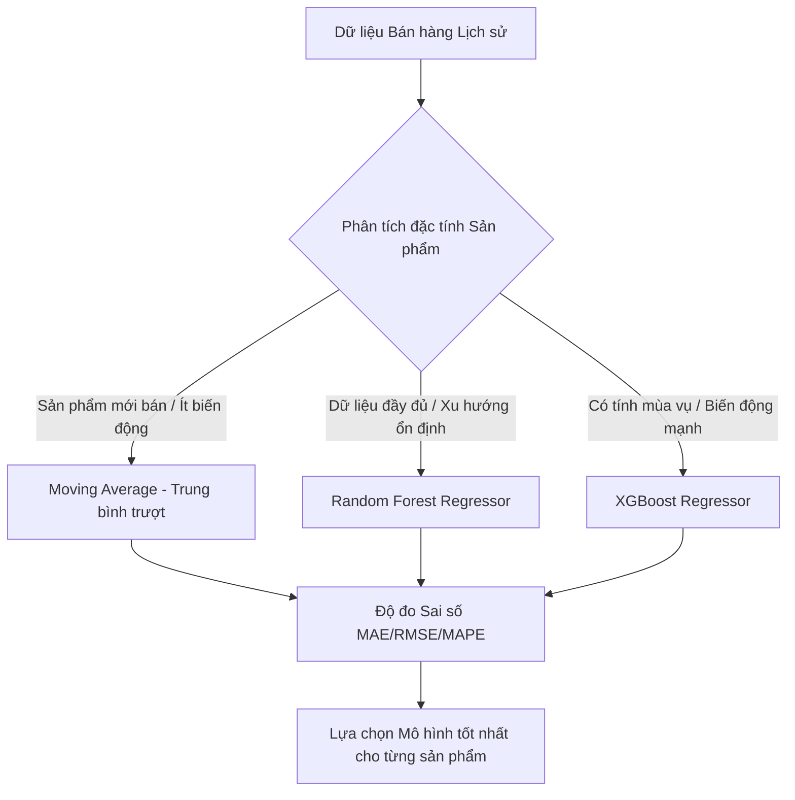
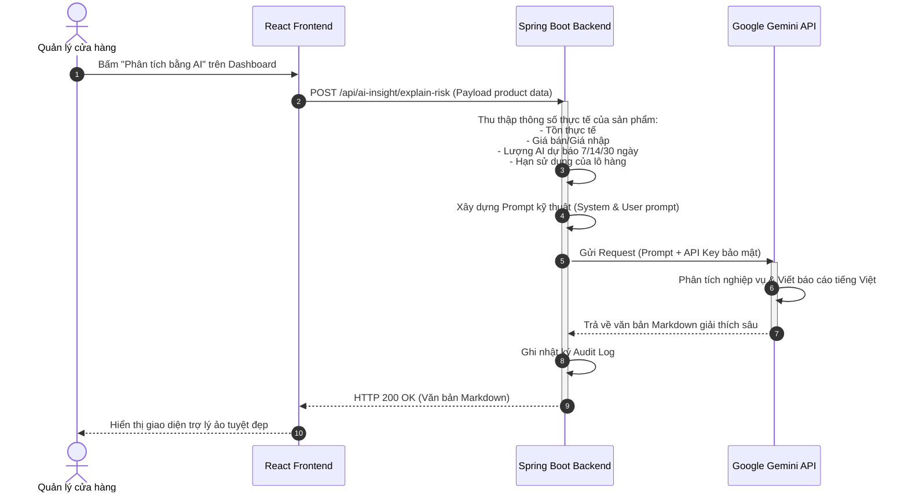

# SmartMart AI - Hệ thống Quản lý Siêu thị Mini & Tối ưu Tồn kho bằng AI
## 05. CHI TIẾT LÕI AI & DỰ BÁO NHU CẦU (AI FORECASTING ENGINE)

---

### 1. Kiến trúc mô hình Học máy (Machine Learning Models)
Để dự báo chính xác số lượng bán ra của hàng trăm mặt hàng khác nhau trong siêu thị mini, hệ thống triển khai giải pháp kết hợp giữa 3 phương pháp học máy phổ biến để phù hợp với từng nhóm sản phẩm:



*   **Moving Average (Trung bình trượt):** Áp dụng hiệu quả cho các sản phẩm mới nhập kho có lịch sử bán hàng dưới 30 ngày hoặc các sản phẩm có lượng tiêu thụ cực kỳ ổn định, không biến động theo mùa vụ. Phương pháp này đóng vai trò là mô hình nền tảng (Baseline Model).
*   **Random Forest Regressor (Rừng ngẫu nhiên):** Mô hình Ensemble bền bỉ, không bị ảnh hưởng mạnh bởi các điểm nhiễu (outliers) trong dữ liệu bán lẻ (ví dụ: ngày đột biến mua hàng số lượng lớn của một cá nhân). Phù hợp với đại đa số sản phẩm tiêu dùng nhanh (FMCG).
*   **XGBoost Regressor (Extreme Gradient Boosting):** Thuật toán tối ưu hóa cây quyết định có hiệu năng dự báo hàng đầu hiện nay. XGBoost nắm bắt cực tốt các yếu tố phi tuyến, xu hướng mùa vụ (nhu cầu tăng đột biến vào cuối tuần, ngày lễ Tết) và các mối quan hệ phức tạp giữa các thuộc tính đặc trưng.

---

### 2. Kỹ nghệ đặc trưng (Feature Engineering & Input Data)
Trước khi đưa vào mô hình học máy, dữ liệu bán lẻ thô từ PostgreSQL sẽ được FastAPI dịch chuyển thời gian và tính toán để tạo thành các đặc trưng (features) chất lượng cao:

#### 2.1. Nhóm đặc trưng trễ thời gian (Lag Features)
Giúp mô hình nhận biết được hành vi tiêu dùng trong quá khứ gần:
*   `sales_lag_1`: Lượng bán ra của sản phẩm ngày hôm qua ($D-1$).
*   `sales_lag_2`: Lượng bán ra của sản phẩm ngày hôm kia ($D-2$).
*   `sales_lag_3`: Lượng bán ra của sản phẩm cách đây 3 ngày ($D-3$).
*   `sales_lag_7`: Lượng bán ra của sản phẩm cùng ngày này tuần trước ($D-7$ - cực kỳ quan trọng để phát hiện tính tuần hoàn theo tuần).
*   `sales_lag_14`: Lượng bán ra của sản phẩm cách đây 2 tuần ($D-14$).

#### 2.2. Nhóm thống kê trượt (Rolling Statistics Features)
Giúp làm mịn dữ liệu nhiễu và nắm bắt xu hướng tăng trưởng ngắn hạn và trung hạn:
*   `rolling_mean_7`: Trung bình cộng lượng bán trong 7 ngày gần nhất.
*   `rolling_mean_30`: Trung bình cộng lượng bán trong 30 ngày gần nhất.
*   `rolling_std_7`: Độ lệch chuẩn lượng bán trong 7 ngày gần nhất (đo lường độ biến động nhu cầu).

#### 2.3. Nhóm đặc trưng thời gian (Calendar Features)
*   `day_of_week`: Thứ trong tuần (Giá trị từ 0 đến 6 đại diện cho Thứ 2 đến Chủ nhật - giúp mô hình nắm bắt sức mua tăng vọt cuối tuần).
*   `day_of_month`: Ngày trong tháng (Giá trị từ 1 đến 31 - giúp mô hình học hành vi mua sắm tăng cao vào ngày nhận lương đầu/cuối tháng).
*   `month`: Tháng trong năm (Giá trị từ 1 đến 12 - nắm bắt tính mùa vụ dài hạn như đồ uống lạnh mùa hè, bánh kẹo Tết).
*   `is_weekend`: Cờ nhị phân (0 hoặc 1) xác định ngày cuối tuần (Thứ 7 & Chủ nhật).
*   `is_holiday`: Cờ nhị phân ngày lễ VN cố định (01-01, 30/4, 01/5, 02/9) — **đã triển khai** trong `ai-service/app/services/preprocess.py`.

#### 2.4. Nhóm đặc trưng danh mục (Categorical Embeddings)
*   `category_id`: Định danh danh mục sản phẩm (giúp mô hình học được hành vi chung của cả nhóm hàng hóa, ví dụ: nhóm Sữa tươi thường có vòng đời ngắn hơn nhóm Đồ gia dụng).

---

### 3. Quy trình Huấn luyện & Dự báo học máy (Execution Flows)

#### 3.1. Quy trình Huấn luyện lại mô hình (Model Retraining Flow)
Quy trình này được thực hiện định kỳ hàng tuần hoặc khi Manager bấm nút huấn luyện thủ công trên giao diện:

1.  **Kích hoạt:** Manager gửi yêu cầu từ React Frontend tới Spring Boot Backend.
2.  **Trích xuất dữ liệu (Data Extraction):** Spring Boot thực hiện một câu lệnh SQL tổng hợp lịch sử bán lẻ của **180 ngày gần nhất** từ bảng `sales_order_items` và `sales_orders`, gom nhóm theo ngày (`sale_date::date`) và sản phẩm (`product_id`).
3.  **Truyền tải:** Spring Boot gọi API `POST /ai/train` của FastAPI AI Service, truyền payload dữ liệu lịch sử dạng JSON khổng lồ.
4.  **Huấn luyện:**
    *   FastAPI nhận dữ liệu, chuyển đổi thành Pandas DataFrame và thực hiện điền khuyết dữ liệu (Imputation) cho những ngày sản phẩm không có giao dịch bán lẻ (điền giá trị 0).
    *   Tự động sinh các Features đã mô tả ở phần 2.
    *   Chia dữ liệu thành 2 tập: **80% Train** và **20% Test** theo thời gian (Time-series split - để tránh rò rỉ dữ liệu tương lai).
    *   Tiến hành train song song mô hình Random Forest và XGBoost.
5.  **Đánh giá & Lưu trữ:**
    *   Tính toán các chỉ số sai số trên tập Test: MAE (Sai số tuyệt đối trung bình), RMSE (Căn phương sai số trung bình bình phương), và MAPE (Phần trăm sai số tuyệt đối trung bình).
    *   Chọn mô hình có MAPE thấp nhất làm Active Model.
    *   Lưu mô hình được chọn dưới dạng file nhị phân `.joblib` vào thư mục `ai-service/app/saved_models/` kèm tên file định danh phiên bản.
6.  **Hoàn tất:** FastAPI trả kết quả thành công và các chỉ số MAE, RMSE, MAPE về Spring Boot Backend để ghi nhận vào bảng `model_training_history`.

#### 3.2. Quy trình Thực hiện Dự báo nhu cầu (Model Forecasting Flow)
Quy trình này tự động chạy hàng ngày vào lúc 0h00 sáng hoặc chạy tức thời khi huấn luyện xong mô hình:

1.  **Gọi API:** Spring Boot Backend gọi API `POST /ai/forecast/all` sang FastAPI.
2.  **Suy diễn (Inference):**
    *   FastAPI tải mô hình `.joblib` đang hoạt động tốt nhất từ ổ đĩa.
    *   Lấy dữ liệu bán hàng của 30 ngày gần nhất làm giá trị đầu vào (Input lag values).
    *   Thực hiện suy diễn đệ quy (Recursive multi-step forecasting) để dự báo sản lượng bán ra cho **từng sản phẩm** trong 30 ngày tương lai.
    *   Cộng dồn kết quả để tính toán sản lượng bán ra dự kiến trong 3 mốc thời gian cốt lõi: **7 ngày tới**, **14 ngày tới**, và **30 ngày tới**.
3.  **Lưu trữ & Phân tích:**
    *   FastAPI trả danh sách kết quả về Spring Boot.
    *   Spring Boot lưu dữ liệu dự báo vào bảng `forecast_results`.
    *   Hệ thống chạy thuật toán kiểm tra tồn kho an toàn để tự động tính toán đề xuất lượng đặt hàng mới (`reorder_recommendations`).
    *   Tự động sinh các cảnh báo tồn kho thấp (`LOW_STOCK`) hoặc rủi ro đứt hàng (`HIGH_RISK`) nếu cần.

---

### 4. Tích hợp Trợ lý Gemini AI (Generative AI Explanations)
Điểm vượt trội của SmartMart AI là khả năng "bình dân hóa" các con số thống kê học máy khô khan thành những lời khuyên chiến lược dễ hiểu thông qua việc tích hợp **Google Gemini API** (sử dụng model `gemini-1.5-flash` để tối ưu tốc độ phản hồi).



#### 4.1. Kỹ thuật thiết kế Prompt mẫu (System Prompt Engineering)
Hệ thống cấu hình một System Prompt chặt chẽ để hướng dẫn Gemini đóng vai trò là một chuyên gia phân tích chuỗi cung ứng bán lẻ tài ba:

```text
Bạn là Trợ lý phân tích chuỗi cung ứng thông minh của hệ thống SmartMart AI. 
Nhiệm vụ của bạn là nhận các thông số kinh doanh thực tế và kết quả dự báo học máy của một sản phẩm từ hệ thống, sau đó viết một bản phân tích ngắn gọn, trực quan bằng tiếng Việt (định dạng Markdown đẹp mắt) hỗ trợ Người quản lý siêu thị mini đưa ra quyết định nhập hàng hoặc khuyến mãi.

Hãy tuân thủ nghiêm ngặt các quy tắc sau:
1. Tuyệt đối không tự bịa đặt, giả định hoặc thay đổi các con số thống kê được cung cấp. Chỉ sử dụng đúng dữ liệu hệ thống gửi sang.
2. Văn phong chuyên nghiệp, thực tế, tập trung vào hành động (Action-oriented).
3. Đưa ra cảnh báo rõ ràng nếu sản phẩm có nguy cơ đứt hàng (High Supply Risk) hoặc rủi ro hết hạn (Expiry Risk).
4. Đề xuất số lượng nhập hàng hoặc mức giảm giá khuyến mãi cụ thể dựa trên số liệu thực tế được gửi.
```

#### 4.2. Cấu trúc Prompt Người dùng gửi sang (User Prompt Template)
Spring Boot Backend sẽ tự động ráp dữ liệu thực tế vào template sau để gửi sang Gemini API:

```text
Hãy phân tích sản phẩm sau:
- Tên sản phẩm: {productName}
- Danh mục: {categoryName}
- Tồn kho thực tế hiện tại: {currentStock} {unit}
- Ngưỡng tồn kho tối thiểu cấu hình: {minStockLevel} {unit}
- Giá nhập gần nhất: {importPrice} VND | Giá bán lẻ niêm yết: {sellingPrice} VND
- Dự báo nhu cầu tiêu thụ từ mô hình học máy:
  + Trong 7 ngày tới: {predicted7d} {unit}
  + Trong 14 ngày tới: {predicted14d} {unit}
  + Trong 30 ngày tới: {predicted30d} {unit}
- Quản lý hạn sử dụng: {hasExpiry} (Hạn sử dụng lô hiện tại: {expiryDate})

Yêu cầu phân tích:
1. Đánh giá trạng thái tồn kho hiện tại (Có an toàn không? Có rủi ro đứt hàng hay ứ đọng vốn không?).
2. Giải thích ý nghĩa của các con số dự báo học máy (Tốc độ tiêu thụ dự kiến tăng hay giảm?).
3. Đưa ra khuyến nghị nhập hàng cụ thể (Nên nhập thêm bao nhiêu? Khi nào nên đặt hàng?).
4. Nếu sản phẩm cận date, hãy đề xuất chương trình khuyến mãi (Mức giảm giá đề xuất % hoặc combo bán kèm).
```
