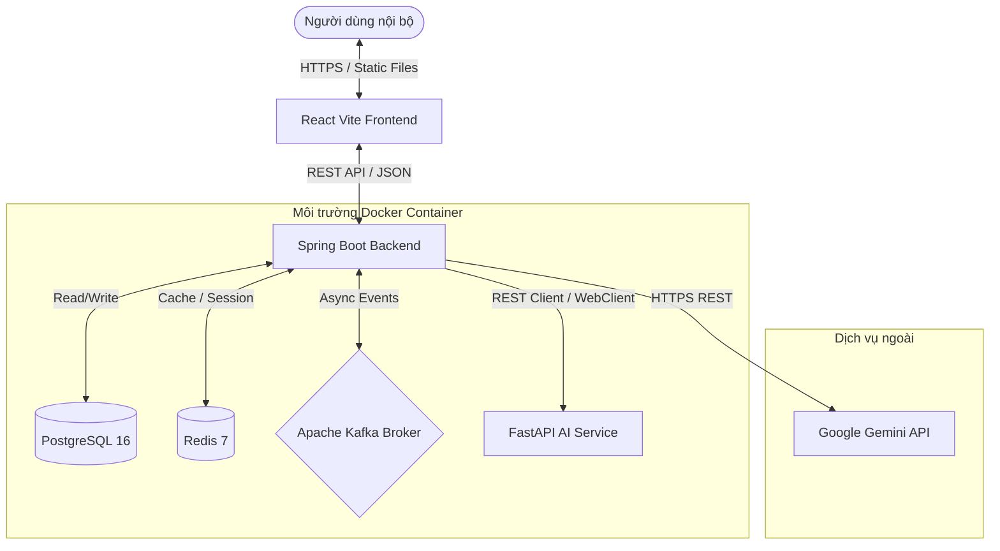
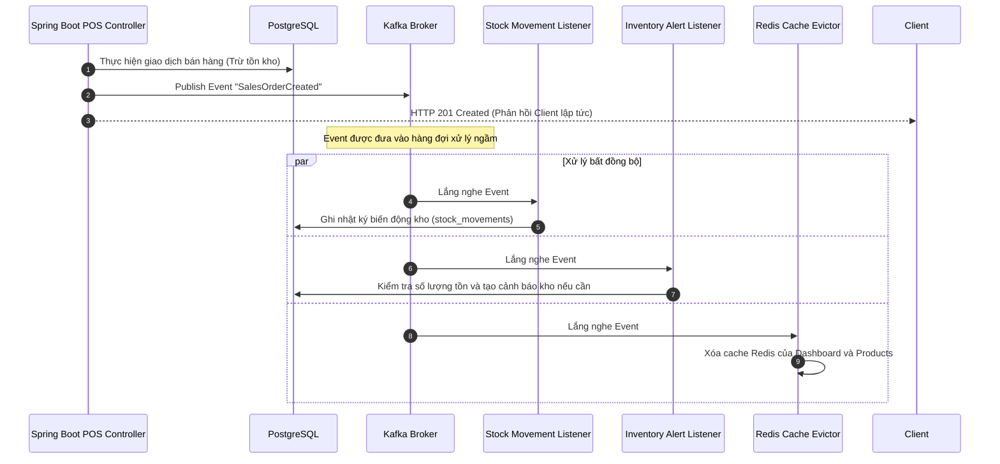

# SmartMart AI - Hệ thống Quản lý Siêu thị Mini & Tối ưu Tồn kho bằng AI
## 06. KIẾN TRÚC HỆ THỐNG CHI TIẾT (SYSTEM ARCHITECTURE)

---

### 1. Sơ đồ Kiến trúc Tổng thể (System Component Diagram)
Hệ thống SmartMart AI được thiết kế theo mô hình kiến trúc phân tầng hiện đại, tách biệt hoàn toàn giữa Frontend UI, Business Backend (Java) và AI Inference Service (Python). Toàn bộ hệ thống giao tiếp qua mạng nội bộ Docker và mạng Internet bảo mật:



*   **Client Layer:** Giao diện React phục vụ trực tiếp trên trình duyệt của người dùng thông qua máy chủ Node.js (Vite).
*   **API Gateway / Backend Layer:** Spring Boot đóng vai trò là "Trái tim của hệ thống". Chịu trách nhiệm xác thực, xử lý các nghiệp vụ giao dịch, quản lý Master Data, quản lý dòng tiền, điều phối các luồng sự kiện và gọi các dịch vụ tính toán AI.
*   **AI/ML Layer:** FastAPI là máy chủ Python siêu nhẹ chuyên xử lý dữ liệu số, chạy các thuật toán huấn luyện học máy (XGBoost, Random Forest) và suy diễn dự báo. Nó nhận dữ liệu và trả kết quả thuần JSON về cho Backend.
*   **Database & Caching Layer:** PostgreSQL lưu trữ trạng thái bền vững; Redis lưu trữ các kết quả tính toán đắt đỏ của AI và số liệu báo cáo Dashboard để giảm tải tức thời cho PostgreSQL.
*   **Message Broker Layer:** Kafka xử lý luồng sự kiện bất đồng bộ để đảm bảo tốc độ phản hồi của API lõi luôn dưới 100ms.

---

### 2. Cấu trúc tổ chức mã nguồn (Package Structures)

#### 2.1. Cấu trúc Backend (Spring Boot 3.2.5)
Mã nguồn Java được tổ chức theo kiến trúc phân tầng (layered), chi tiết chuẩn code tại **[09-backend-coding-standards.md](09-backend-coding-standards.md)**:

```
backend/src/main/java/com/smartmart/
├── config/             # Security, JWT, Redis, Kafka, OpenAPI, DataSeeder
├── controller/         # REST — mỏng, ApiResponse, OpenAPI
├── dto/                # Request/Response (bắt buộc cho API mới)
├── mapper/             # Entity ↔ DTO
├── entity/             # JPA entity (ánh xạ PostgreSQL)
├── repository/         # Spring Data JPA
├── service/
│   ├── impl/           # Business logic, @Transactional
│   └── ai/             # WebClient → FastAPI; Gemini
├── exception/          # AppException, GlobalExceptionHandler
├── enums/
├── security/
├── constant/
├── common/             # ApiResponse, PageResponse, BaseEntity
└── event/              # Kafka producer/consumer (khi triển khai)
```

#### 2.2. Cấu trúc AI Service (FastAPI Python)
Dịch vụ Python được tổ chức tinh gọn, phục vụ mục đích huấn luyện và dự báo dữ liệu:

```
ai-service/app/
├── routers/            # Định nghĩa các API endpoints của FastAPI (train, forecast)
├── schemas/            # Định nghĩa cấu trúc dữ liệu đầu vào/đầu ra bằng Pydantic
├── services/           # Lõi xử lý logic (tiền xử lý dữ liệu, train model, suy diễn)
├── saved_models/       # Thư mục lưu trữ các file mô hình huấn luyện thành công (.joblib)
├── datasets/           # Dữ liệu CSV phục vụ huấn luyện thử nghiệm
└── main.py             # File khởi tạo FastAPI app và cấu hình CORS, Middleware
```

#### 2.3. Cấu trúc Frontend (React + Vite + TypeScript)
Giao diện React được thiết kế theo hướng Component-Driven, tận dụng Tailwind CSS và thư viện UI chất lượng cao:

```
frontend/src/
├── assets/             # Chứa hình ảnh, logo tĩnh của siêu thị
├── components/         # Các UI components tái sử dụng (Button, Table, Card, Input)
│   └── layout/         # Bố cục giao diện (Sidebar, Navbar, Footer)
├── context/            # Quản lý State toàn cục (AuthContext cho JWT)
├── hooks/              # Custom React Hooks để gọi API và quản lý trạng thái UI
├── pages/              # Các màn hình lớn của ứng dụng
│   ├── auth/           # Màn hình đăng nhập
│   ├── dashboard/      # Bảng điều khiển quản lý & Trợ lý Gemini AI
│   ├── pos/            # Màn hình bán hàng tại quầy cho thu ngân
│   ├── products/       # Quản lý danh mục hàng hóa
│   ├── inventory/      # Báo cáo kho & Cảnh báo tồn kho
│   └── purchases/      # Quản lý lập phiếu nhập kho
├── services/           # Axios HTTP Client kết nối với Backend APIs
└── utils/              # Các hàm định dạng tiền tệ, ngày tháng bằng tiếng Việt
```

---

### 3. Luồng xử lý Sự kiện Kafka (Asynchronous Event Timeline)
Hệ thống tận dụng tối đa cơ chế xử lý bất đồng bộ để tăng tính chịu tải và nâng cao trải nghiệm người dùng:



#### Chi tiết các Topic và Event Schema trong hệ thống:
1.  **Topic: `sales-orders`**
    *   *Event:* `SalesOrderCreatedEvent`
    *   *Payload:* `{ "orderId": 10045, "staffId": "uuid", "totalAmount": 450000.00, "items": [{"productId": 12, "quantity": 3}] }`
    *   *Consumers:*
        *   `StockMovementListener`: Tự động chèn 1 bản ghi `movement_type = 'SALE'` vào bảng `stock_movements`.
        *   `InventoryAlertListener`: Kiểm tra lượng tồn kho thực tế của sản phẩm 12. Nếu $\text{currentStock} \le \text{minStockLevel}$, tự động ghi nhận 1 cảnh báo `LOW_STOCK` vào bảng `inventory_alerts`.
        *   `CacheEvictor`: Xóa trắng các keys cache liên quan trên Redis.
2.  **Topic: `purchase-orders`**
    *   *Event:* `PurchaseOrderCreatedEvent`
    *   *Payload:* `{ "purchaseId": 5002, "supplierId": 3, "totalCost": 12000000.00, "items": [{"productId": 12, "quantity": 100}] }`
    *   *Consumers:*
        *   `StockMovementListener`: Tự động chèn 1 bản ghi `movement_type = 'PURCHASE'`.
        *   `InventoryAlertListener`: Kiểm tra nếu tồn kho sản phẩm 12 đã vượt qua ngưỡng an toàn, tự động đổi trạng thái cảnh báo cũ từ `ACTIVE` sang `RESOLVED`.
        *   `CacheEvictor`: Giải phóng cache Redis.

---

### 4. Chiến lược bộ nhớ đệm Redis (Redis Cache & Eviction Strategy)
Hệ thống triển khai Redis để lưu trữ bộ nhớ đệm (Cache) nhằm giảm tải tối đa cho PostgreSQL đối với các truy vấn đọc nặng, có tần suất lặp lại cao:

| Cache Key Pattern | Dữ liệu lưu trữ | Thời gian sống (TTL) | Cơ chế xóa Cache (Eviction Trigger) |
| :--- | :--- | :---: | :--- |
| `dashboard::summary` | Con số tổng hợp trên màn hình Dashboard chính (Doanh thu ngày, Hóa đơn ngày). | 10 Phút | Bị xóa lập tức (Evict) khi nhận được sự kiện `SalesOrderCreatedEvent` hoặc `PurchaseOrderCreatedEvent`. |
| `products::list::*` | Danh sách sản phẩm phân trang và tìm kiếm phục vụ màn hình POS. | 1 Giờ | Bị xóa khi có bất kỳ hành động cập nhật Master Data sản phẩm nào (`INSERT`, `UPDATE`, `DELETE` sản phẩm). |
| `forecast::results::*` | Chi tiết kết quả dự báo 7/14/30 ngày của sản phẩm. | 24 Giờ | Bị xóa khi hệ thống chạy thành công một phiên huấn luyện và dự báo AI mới (`forecast:run` hoàn tất). |
| `auth::blacklist::*` | Danh sách các JWT Access Token đã thực hiện đăng xuất trước hạn. | Bằng thời gian sống còn lại của Token | Tự động biến mất khỏi Redis nhờ cơ chế TTL tự nhiên sau khi Token hết hạn hoàn toàn. |
