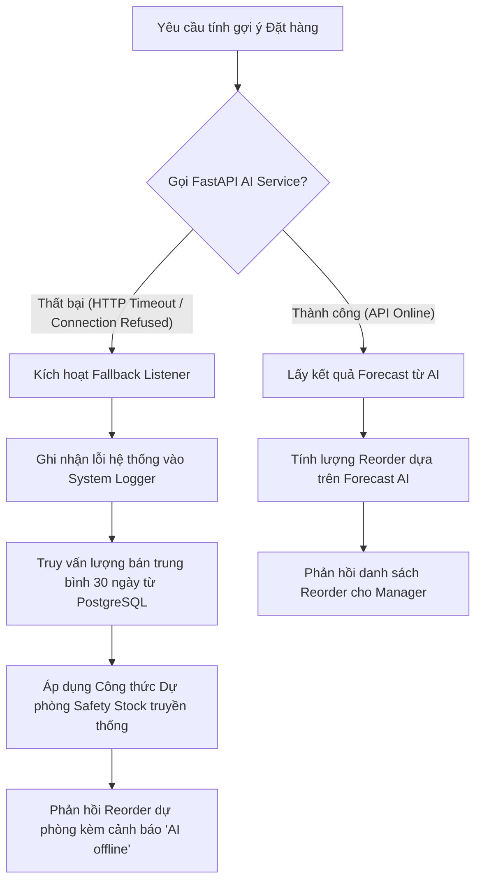

# SmartMart AI - Hệ thống Quản lý Siêu thị Mini & Tối ưu Tồn kho bằng AI
## 07. KẾ HOẠCH KIỂM THỬ HỆ THỐNG (TESTING PLAN)

---

### 1. Kế hoạch kiểm thử Phân quyền (RBAC Testing Plan)
Mục tiêu là đảm bảo rằng mọi Endpoint API đều được bảo vệ nghiêm ngặt bằng Spring Security và chỉ cho phép các Role được chỉ định truy cập. Mọi nỗ lực truy cập trái phép phải bị từ chối bằng mã lỗi HTTP tương ứng.

#### Kịch bản kiểm thử Phân quyền mẫu:

| Mã Test Case | API Endpoint kiểm thử | Người thực hiện (Role) | Dữ liệu đầu vào (Input) | Kết quả mong đợi (Expected Output) |
| :--- | :--- | :--- | :--- | :--- |
| **TC-RBAC-01** | `GET /api/users` | `STAFF` | None (Gửi kèm Token JWT của STAFF) | HTTP **403 Forbidden**. Không trả về danh sách người dùng. |
| **TC-RBAC-02** | `GET /api/users` | `ADMIN` | None (Gửi kèm Token JWT của ADMIN) | HTTP **200 OK**. Trả về danh sách tài khoản nhân viên. |
| **TC-RBAC-03** | `POST /api/categories` | `STAFF` | `{ "name": "Đồ gia dụng" }` | HTTP **403 Forbidden**. Không tạo được danh mục mới. |
| **TC-RBAC-04** | `POST /api/categories` | `WAREHOUSE` | `{ "name": "Đồ gia dụng" }` | HTTP **201 Created**. Tạo danh mục thành công. |
| **TC-RBAC-05** | `POST /api/sales-orders`| `WAREHOUSE` | `{ "items": [{"productId":1, "quantity":1}] }`| HTTP **403 Forbidden**. Nhân viên kho không được phép bán hàng. |
| **TC-RBAC-06** | `POST /api/forecast/train`| `MANAGER` | None | HTTP **200 OK**. Kích hoạt huấn luyện AI thành công. |

---

### 2. Kế hoạch kiểm thử Giao dịch bán hàng POS (POS Transactions)
Mục tiêu là kiểm tra tính toàn vẹn giao dịch (ACID) của nghiệp vụ bán lẻ trực tiếp tại quầy, đảm bảo tồn kho thực tế bị trừ chính xác và các luồng sự kiện Kafka, Redis được kích hoạt đúng đắn.

#### Kịch bản kiểm thử Giao dịch POS mẫu:

| Mã Test Case | Tên Kịch bản kiểm thử | Mô tả các bước thực hiện | Kết quả mong đợi (Expected Output) |
| :--- | :--- | :--- | :--- |
| **TC-POS-01** | **Bán hàng thành công khi đủ tồn kho** | 1. Chọn sản phẩm ID 12 (Tồn kho hiện tại: 50 chai Sữa). 2. Gọi API bán 3 chai sữa. 3. Kiểm tra kết quả phản hồi và trạng thái database. | • HTTP **201 Created**. • Số tồn kho sản phẩm 12 giảm xuống còn 47. • Ghi nhận 1 bản ghi Stock Movement loại `SALE` với số lượng 3. • Publish thành công sự kiện `SalesOrderCreatedEvent` lên Kafka. |
| **TC-POS-02** | **Từ chối bán hàng khi tồn kho không đủ**| 1. Chọn sản phẩm ID 12 (Tồn kho hiện tại: 47 chai). 2. Gọi API bán 100 chai sữa. 3. Kiểm tra kết quả phản hồi và trạng thái database. | • HTTP **400 Bad Request**. • Báo lỗi cụ thể: `InsufficientStockException`. • Tồn kho của sản phẩm 12 giữ nguyên là 47 (Transaction rollback hoàn toàn). • Không tạo ra hóa đơn và không ghi nhận Stock Movement. |
| **TC-POS-03** | **Từ chối bán sản phẩm hết hạn sử dụng** | 1. Chọn sản phẩm ID 25 (Có `expiry_date` trước ngày hôm nay). 2. Gọi API bán lẻ sản phẩm này. 3. Kiểm tra kết quả. | • HTTP **400 Bad Request**. • Báo lỗi cụ thể: `ProductExpiredException`. • Không cho phép tạo hóa đơn thành công. |
| **TC-POS-04** | **Hủy hóa đơn và hoàn trả tồn kho** | 1. Lấy hóa đơn ID 10045 vừa bán 3 chai sữa (sản phẩm 12). 2. Gọi API `POST /api/sales-orders/10045/cancel` dưới quyền MANAGER. 3. Kiểm tra tồn kho. | • HTTP **200 OK**. • Trạng thái hóa đơn chuyển sang `CANCELLED`. • Tồn kho sản phẩm 12 tự động cộng trả lại 3 đơn vị (từ 47 lên 50). • Ghi nhận bản ghi Stock Movement loại `SALE_CANCEL` số lượng 3. |

---

### 3. Kế hoạch kiểm thử Nhập kho & Ràng buộc Hạn sử dụng (Purchase Order & Date Constraints)
Mục tiêu là kiểm soát chặt chẽ chất lượng hàng hóa đầu vào, ngăn chặn tình trạng nhân viên kho vô tình nhập sản phẩm đã hết hạn sử dụng hoặc bỏ sót thông tin hạn dùng của các mặt hàng bắt buộc quản lý.

#### Kịch bản kiểm thử Nhập kho mẫu:

| Mã Test Case | Tên Kịch bản kiểm thử | Mô tả các bước thực hiện | Kết quả mong đợi (Expected Output) |
| :--- | :--- | :--- | :--- |
| **TC-PUR-01**| **Nhập hàng thành công (Sản phẩm không quản lý date)** | 1. Chọn sản phẩm ID 8 (Mì ăn liền Hảo Hảo - `has_expiry = false`). 2. Tạo phiếu nhập 500 gói mì, không điền `expiryDate`. | • HTTP **201 Created**. • Tồn kho thực tế tăng thêm 500. • Tạo thành công Stock Movement loại `PURCHASE`. |
| **TC-PUR-02**| **Từ chối nhập thiếu date (Sản phẩm quản lý date)** | 1. Chọn sản phẩm ID 12 (Sữa tươi - `has_expiry = true`). 2. Tạo phiếu nhập 100 hộp sữa, bỏ trống trường `expiryDate`. | • HTTP **400 Bad Request**. • Báo lỗi: `ExpiryDateRequiredException` (Yêu cầu điền hạn sử dụng). • Tồn kho sản phẩm không thay đổi. |
| **TC-PUR-03**| **Từ chối nhập lô hàng đã hết hạn sử dụng** | 1. Chọn sản phẩm ID 12. 2. Tạo phiếu nhập 100 hộp sữa, điền `expiryDate` là ngày hôm qua. 3. Gửi yêu cầu. | • HTTP **400 Bad Request**. • Báo lỗi: `InvalidExpiryDateException` (Hạn sử dụng không được nhỏ hơn ngày hiện tại). • Giao dịch bị hủy bỏ, không ghi nhận kho. |
| **TC-PUR-04**| **Từ chối nhập hàng từ nhà cung cấp bị khóa** | 1. Chọn nhà cung cấp ID 5 (Đang có trạng thái `INACTIVE`). 2. Lập phiếu nhập hàng gắn với nhà cung cấp này. | • HTTP **400 Bad Request**. • Báo lỗi: `SupplierInactiveException`. |

---

### 4. Kế hoạch kiểm thử Chịu lỗi & Dự phòng khi Dịch vụ AI sập (Fault Tolerance & AI Fallback)
Mục tiêu là đảm bảo tính sẵn sàng cao của hệ thống theo quy tắc `SYS-10`. Nếu FastAPI AI Service gặp sự cố (bị tắt container, mất kết nối mạng nội bộ), hệ thống Spring Boot Backend phải tự động chuyển đổi sang cơ chế tính toán dự phòng dựa trên dữ liệu lịch sử PostgreSQL mà không được treo hoặc sập API.

#### Quy trình kiểm thử và xác minh tính chịu lỗi:
1.  **Bước 1 (Trạng thái bình thường):**
    *   Gọi API `GET /api/forecast/recommendations`.
    *   *Kết quả:* Hệ thống trả về danh sách gợi ý đặt hàng đầy đủ, trường `reason` hiển thị rõ: *"Dựa trên dự báo nhu cầu học máy trong 14 ngày tới..."*.
2.  **Bước 2 (Mô phỏng sự cố sập AI Service):**
    *   Chạy lệnh terminal tắt container FastAPI: `docker compose stop ai-service`.
    *   *Xác minh:* Đảm bảo container FastAPI đã ngưng hoạt động hoàn toàn.
3.  **Bước 3 (Thử nghiệm Fallback):**
    *   Tiếp tục gọi lại API `GET /api/forecast/recommendations` trên React Frontend.
    *   *Kết quả mong đợi:*
        *   API không được trả về lỗi `500 Internal Server Error`.
        *   Hệ thống phản hồi HTTP `200 OK` sau thời gian chờ timeout cấu hình ngắn (ví dụ: 1.5 giây).
        *   Danh sách gợi ý nhập hàng vẫn hiển thị đầy đủ số lượng gợi ý đặt hàng.
        *   Lượng gợi ý được tính bằng công thức dự phòng dựa trên lượng bán trung bình lịch sử 30 ngày qua lấy trực tiếp từ database PostgreSQL.
        *   Response của `POST /api/v1/forecast/run` có `source = "FALLBACK"` và `itemsSubmitted` bằng số SKU active được gửi sang AI.
        *   `GET /api/v1/forecast/recommendations` chỉ cho `ADMIN`, `MANAGER`; `STAFF`, `WAREHOUSE`, `ANALYST` phải bị từ chối `403`.
        *   API gợi ý nhập hàng chỉ trả SKU có `suggestedQty > 0`, kèm `itemCode`, `predictedDemand7d`, `predictedDemand14d`, `source`, `reason` để FE hiển thị chi tiết.
        *   Trường `reason` tự động thay đổi thành: *"Hệ thống AI đang bảo trì. Đề xuất đặt hàng được tính toán bằng phương pháp dự phòng dựa trên lịch sử tiêu thụ 30 ngày qua để đảm bảo an toàn vận hành."*
        *   Một dòng cảnh báo cảnh báo hệ thống (Warning Log) được ghi nhận vào bảng `audit_logs` để báo cho Admin biết dịch vụ AI đang mất kết nối.

---

### 5. Kế hoạch kiểm thử Ca bán & Đối soát tiền

| Mã Test Case | Tên Kịch bản kiểm thử | Kết quả mong đợi |
| :--- | :--- | :--- |
| **TC-SHIFT-01** | Mở ca khi chưa có ca mở | HTTP `201`, trạng thái `OPEN`, lưu `openingCash`. |
| **TC-SHIFT-02** | Đóng ca không lệch tiền | HTTP `200`, trạng thái `CLOSED`, `cashVariance = 0`. |
| **TC-SHIFT-03** | Đóng ca lệch tiền nhưng không nhập lý do | HTTP `400`, không đóng ca. |
| **TC-SHIFT-04** | Đóng ca lệch tiền có lý do | HTTP `200`, trạng thái `PENDING_REVIEW`, lưu `varianceReason`. |
| **TC-SHIFT-05** | Staff duyệt ca lệch tiền | HTTP `403`. |
| **TC-SHIFT-06** | Manager/Admin duyệt ca lệch tiền | HTTP `200`, trạng thái `CLOSED`, lưu `reviewedBy`, `reviewedAt`, `reviewNote`. |

---

### 6. Kế hoạch kiểm thử Công nợ Nhà cung cấp

| Mã Test Case | Tên Kịch bản kiểm thử | Kết quả mong đợi |
| :--- | :--- | :--- |
| **TC-DEBT-01** | Nhận phiếu nhập trả chậm | Tự sinh công nợ `UNPAID`, `amount = totalAmount`, `dueDate = today + 30`. |
| **TC-DEBT-02** | Thanh toán một phần | Trạng thái `PARTIAL`, tăng `paidAmount`, giảm `remainingAmount`. |
| **TC-DEBT-03** | Thanh toán vượt số còn lại | HTTP `400`, không thay đổi công nợ. |
| **TC-DEBT-04** | Thanh toán đủ | Trạng thái `PAID`, `remainingAmount = 0`. |
| **TC-DEBT-05** | Công nợ quá hạn chưa trả đủ | Khi truy vấn, trạng thái chuyển `OVERDUE`. |
