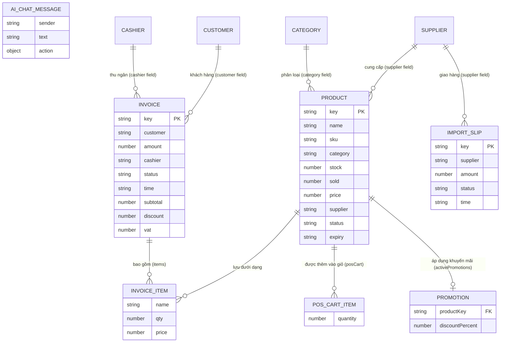
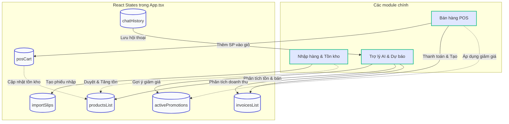

# SmartAI - Frontend Concept Diagram (Updated)

Tôi đã phân tích trực tiếp mã nguồn `App.tsx` của Frontend và nhận thấy các Model (State) thực tế đang được sử dụng khác với hình ảnh ER ban đầu. Dưới đây là sơ đồ Concept Diagram chuẩn xác ánh xạ trực tiếp với cấu trúc dữ liệu hiện tại của Frontend.

## 1. Entity-Relationship Diagram (Biểu đồ ER thực tế theo State)

Biểu đồ này mô tả chính xác các Object/Type đang tồn tại trong `App.tsx` (`Product`, `Invoice`, `ImportSlip`, `POSCart`, `Promotion`, v.v.) và cách chúng liên kết với nhau:

## 2. System Flow / Logic Diagram (Luồng dữ liệu Frontend)

Sơ đồ này mô tả cách các tính năng trên màn hình tác động đến dữ liệu State:

